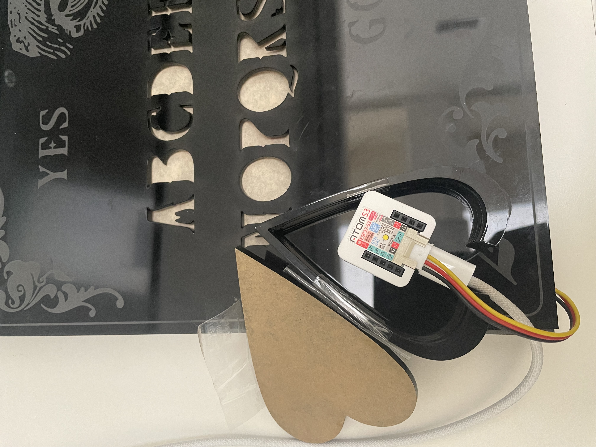

## Introduction   

I made an electronic version of the Ouija board that can be triggered by detecting the movement of the Ouija board attachment triangle (the atoms3 board is stuck to it), which randomly selects a vague sentence and gives the answer to the user's question on the board by lighting up the letters.

## Implementation   
#### Setup:
I used an LED strip with thirty beads
Designed the Ouija board pattern and structure in figma
Laser printed and assembled the prototype

#### Code:
I coded the project in thonny with micropython

### Hardware

* LED strips
* atoms3
* Extended Dupont wires 

  
  

### Firmware   

``` Python  
import os, sys, io
import M5
from M5 import *
from hardware import *
import time
import random

print("初始化 M5 设备并准备检测内置 IMU 的运动...")

# 初始化设备
M5.begin()

# 初始化 RGB 灯带（G1 引脚，30 颗 LED）
rgb_strip = RGB(io=2, n=30, type="SK6812")

# 定义颜色
vibrant_pink_color = (255, 105, 180)  # 鲜艳的粉色
hot_pink_color = (255, 20, 147)       # 艳粉色
red_color = (255, 0, 0)               # 红色

# 设置运动的阈值
ACCEL_THRESHOLD = 1.0

# 定义句子
sentences = [
    "Ask and see",
    "What do you seek",
    "It your path",
    "Trust it",
    "A fog",
    "grip the fate",
    "Luck is a gift",
    "Show a path",
    "Dusk fades",
    "It is your choice"
]

# 字母到 LED 灯珠的映射关系
led_map = {
    'A': 1, 'B': 2, 'C': 3, 'D': 4, 'E': 5, 'F': 6, 'G': 7, 'H': 8, 'I': 9,
    'J': 10, 'K': 11, 'L': 12, 'M': 13, 'O': 29, 'P': 28, 'Q': 27, 'R': 26,
    'S': 25, 'T': 24, 'U': 23, 'V': 22, 'W': [20, 21], 'X': 19, 'Y': 18, 'Z': 17
}


def set_led_color(led_index, color):
    """设置特定 LED 的颜色"""
    if isinstance(led_index, list):  # 如果是多个灯珠（如 'W'）
        for idx in led_index:
            rgb_strip.set_color(idx, (color[0] << 16) | (color[1] << 8) | color[2])
    else:
        rgb_strip.set_color(led_index, (color[0] << 16) | (color[1] << 8) | color[2])

def display_word(word):
    """逐个字母显示单词"""
    letter_count = {}

    for letter in word.upper():
        if letter in led_map:
            letter_count[letter] = letter_count.get(letter, 0) + 1
            if letter_count[letter] == 1:
                color = vibrant_pink_color
            elif letter_count[letter] == 2:
                color = hot_pink_color
            else:
                color = red_color
            led_index = led_map[letter]
            set_led_color(led_index, color)
            time.sleep(0.5)
            rgb_strip.fill_color(0x000000)  # 熄灭
            time.sleep(0.3)

    # 保持单词亮起
    for letter in word.upper():
        if letter in led_map:
            count = letter_count[letter]
            color = vibrant_pink_color if count == 1 else (hot_pink_color if count == 2 else red_color)
            led_index = led_map[letter]
            set_led_color(led_index, color)
    time.sleep(2.0)

def display_sentence_by_word(sentence):
    """逐个单词显示句子"""
    words = sentence.split()
    for word in words:
        display_word(word)
        time.sleep(0.5)

def detect_horizontal_motion():
    """检测 IMU 的横向运动"""
    imu_data = Imu.getAccel()
    acc_x = imu_data[0]
    acc_y = imu_data[1]
    magnitude = (acc_x**2 + acc_y**2) ** 0.5
    print(f"IMU motion range: {magnitude:.2f}")
    return magnitude > ACCEL_THRESHOLD


while True:
    M5.update()

    # 检测 IMU 的横向运动
    if detect_horizontal_motion():
        print("运动触发，逐词显示句子")
        selected_sentence = random.choice(sentences)
        print(f"Selected sentence: {selected_sentence}")

        # 显示句子
        display_sentence_by_word(selected_sentence)

    time.sleep(0.1)


```

## Project outcome  

Summarize the results of your final project implementation and include some photos of the prototype and a video walkthrough showing it working.  

Note that GitHub has a small size limit for uploading files via browswer (25Mb max), so you may choose to use a link to YouTube, Google Drive, or another external site.

## Conclusion  

As you wrap up the project, reflect on your experience of creating it.  Use this as an opportunity to mention any discoveries or challenges you came across along the way.  If there is anything you would have done differently, or have a chance to continue the project development given more time or resources, it’s a good way to conclude this section.

## Project references  

Please include links to any online resources like videos or tutorials that you may have found helpful in your process of implementing the prototype. If you used any substantial code from an online resource, make sure to credit the author(s) or sources.  
