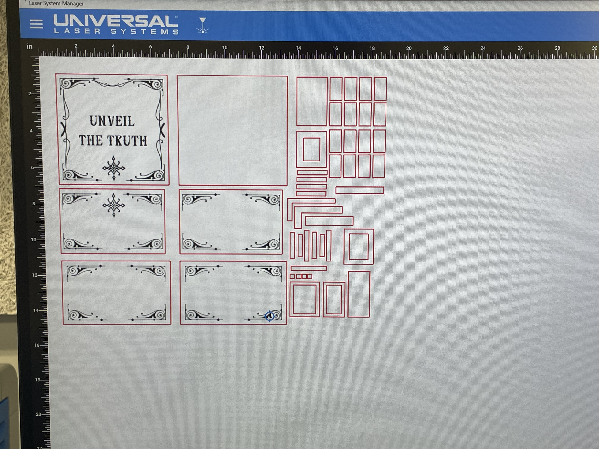
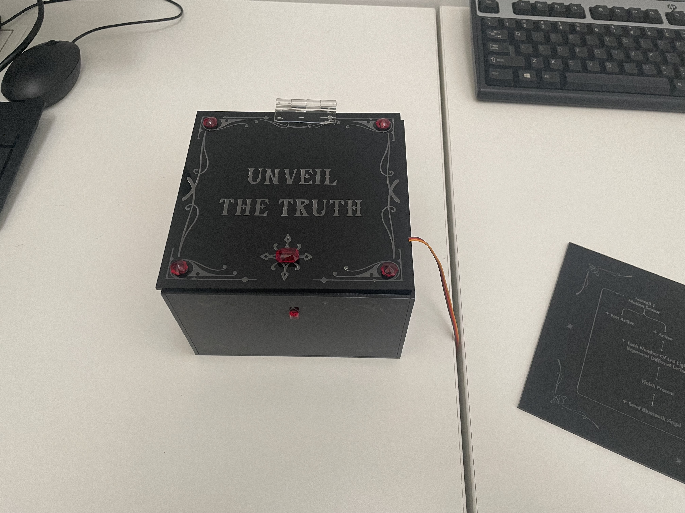
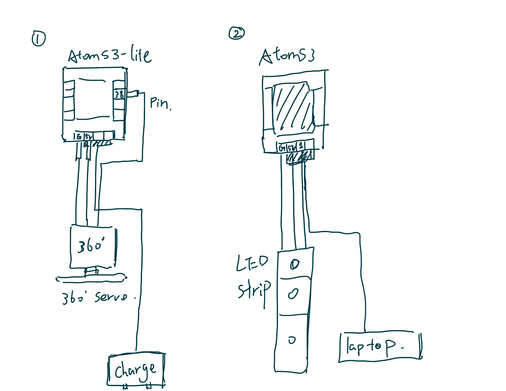
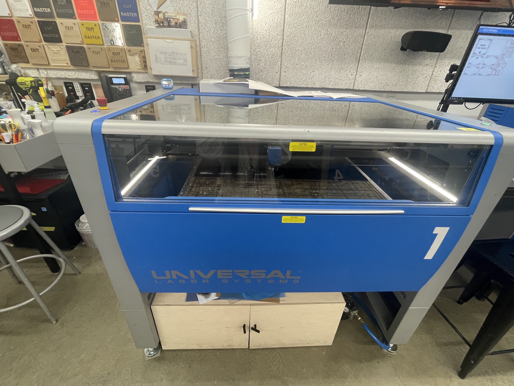
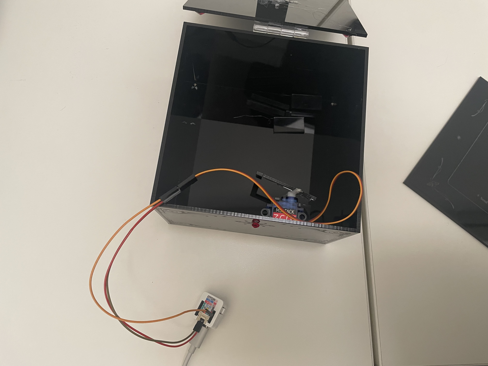
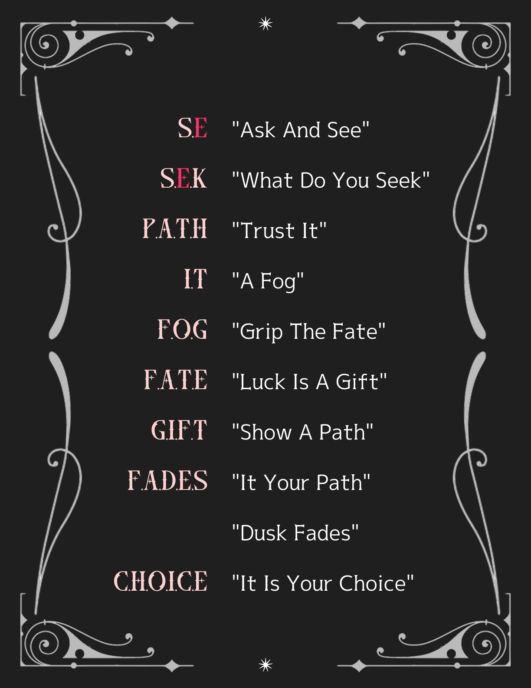

## Introduction   

Based on project 02, I decided to add some communication elements. In the test of the previous project, I found that people have difficulty reading the answers of the Ouija board.
So, this is a small metaphysical experience. Users can first silently recite the questions they want to answer, then move the small triangle on the Ouija board, wait for the Ouija board to show the answer, open the locked box after the answer is shown, take out the answer decryption book from it, crack the code, and get the answer

## Implementation   

I divided the whole process into two steps
First I tried to solve the problem of two hardwares communicating. At first, I chose to use wifi for communication between the two hardwares
``` Python  
if(sensor_val > 100):  # sensor value higher than threshold
   led_pin.on()  # turn on LED
```

Then I made a small box with the answer code book out of cardboard
After obtaining the data, I drew a drawing for the laser
  

Then I went to laser print the assembly parts of the small box
  

### Hardware

* Atoms3-lite
* Extended Dupont Cables
* 360 Motors

  

### Firmware   

After discussing with the professor, I changed the communication method between the two hardware from wifi to Bluetooth connection.
First, the code for the Ouija board

``` Python
import os, sys, io
import M5
from M5 import *
from bleuart import *
from hardware import *
import time
import random

print("初始化 M5 设备并准备检测内置 IMU 的运动...")

# 初始化设备
M5.begin()

# 初始化 RGB 灯带（G1 引脚，30 颗 LED）
rgb_strip = RGB(io=2, n=30, type="SK6812")

# 定义颜色
vibrant_pink_color = (255, 105, 180)  # 鲜艳的粉色
hot_pink_color = (255, 20, 147)       # 艳粉色
red_color = (255, 0, 0)               # 红色

# 设置运动的阈值
ACCEL_THRESHOLD = 1.0

# 初始化 BLE 客户端
ble_client = BLEUARTClient()
print("BLE client initialized. Searching for server 'ble-art'...")

# 定义句子
sentences = [
    "Ask and see",
    "What do you seek",
    "It your path",
    "Trust it",
    "A fog",
    "grip the fate",
    "Luck is a gift",
    "Show a path",
    "Dusk fades",
    "It is your choice"
]

# 字母到 LED 灯珠的映射关系
led_map = {
    'A': 1, 'B': 2, 'C': 3, 'D': 4, 'E': 5, 'F': 6, 'G': 7, 'H': 8, 'I': 9,
    'J': 10, 'K': 11, 'L': 12, 'M': 13, 'O': 29, 'P': 28, 'Q': 27, 'R': 26,
    'S': 25, 'T': 24, 'U': 23, 'V': 22, 'W': [20, 21], 'X': 19, 'Y': 18, 'Z': 17
}

def connect_to_ble_server():
    """连接到 BLE 服务端"""
    try:
        ble_client.connect('ble-art', timeout=5000)  # 尝试连接到服务端
        if ble_client.is_connected():
            print("BLE client connected to 'ble-art'.")
        else:
            print("Failed to connect to BLE server.")
    except Exception as e:
        print("BLE connection error:", e)

def send_unlock_signal():
    """通过蓝牙发送解锁指令"""
    if ble_client.is_connected():
        print("发送解锁指令...")
        try:
            ble_client.write("unlock")
            print("解锁指令已发送.")
        except Exception as e:
            print("发送解锁指令时出错:", e)
    else:
        print("蓝牙未连接，无法发送解锁指令.")

def set_led_color(led_index, color):
    """设置特定 LED 的颜色"""
    if isinstance(led_index, list):  # 如果是多个灯珠（如 'W'）
        for idx in led_index:
            rgb_strip.set_color(idx, (color[0] << 16) | (color[1] << 8) | color[2])
    else:
        rgb_strip.set_color(led_index, (color[0] << 16) | (color[1] << 8) | color[2])

def display_word(word):
    """逐个字母显示单词"""
    letter_count = {}

    for letter in word.upper():
        if letter in led_map:
            letter_count[letter] = letter_count.get(letter, 0) + 1
            if letter_count[letter] == 1:
                color = vibrant_pink_color
            elif letter_count[letter] == 2:
                color = hot_pink_color
            else:
                color = red_color
            led_index = led_map[letter]
            set_led_color(led_index, color)
            time.sleep(0.5)
            rgb_strip.fill_color(0x000000)  # 熄灭
            time.sleep(0.3)

    # 保持单词亮起
    for letter in word.upper():
        if letter in led_map:
            count = letter_count[letter]
            color = vibrant_pink_color if count == 1 else (hot_pink_color if count == 2 else red_color)
            led_index = led_map[letter]
            set_led_color(led_index, color)
    time.sleep(2.0)

def display_sentence_by_word(sentence):
    """逐个单词显示句子"""
    words = sentence.split()
    for word in words:
        display_word(word)
        time.sleep(0.5)

def detect_horizontal_motion():
    """检测 IMU 的横向运动"""
    imu_data = Imu.getAccel()
    acc_x = imu_data[0]
    acc_y = imu_data[1]
    magnitude = (acc_x**2 + acc_y**2) ** 0.5
    print(f"IMU motion range: {magnitude:.2f}")
    return magnitude > ACCEL_THRESHOLD

# 蓝牙连接
connect_to_ble_server()

while True:
    M5.update()

    # 检测 IMU 的横向运动
    if detect_horizontal_motion():
        print("运动触发，逐词显示句子")
        selected_sentence = random.choice(sentences)
        print(f"Selected sentence: {selected_sentence}")

        # 显示句子
        display_sentence_by_word(selected_sentence)

        # 显示完成后发送解锁指令
        send_unlock_signal()

    time.sleep(0.1)


```

Then the code for the small box
``` Python
import os, sys, io
import M5
from M5 import *
from bleuart import *
import time
from machine import Pin, PWM

# 初始化舵机信号引脚
servo = PWM(Pin(38), freq=50)  # 使用 GPIO 38（G38）

def open_bolt():
    """让舵机反转，推开螺栓"""
    print("Opening bolt...")
    servo.duty(85)  # 使用反转范围内的占空比（79-100）
    time.sleep(0.75)  # 反转持续时间
    servo.duty(73)  # 停止信号
    print("Bolt is open.")

# 初始化设备
M5.begin()

# 初始化 BLE 服务端
ble_server = BLEUARTServer(name='ble-uart')
print("BLE server started, broadcasting as 'ble-uart'")
print("Waiting for Bluetooth connection...")

while True:
    M5.update()
    
    # 监听来自客户端的数据
    data = ble_server.read()
    if data != '':
        command = data.decode().strip()
        print("收到指令:", command)

        if command == "unlock":
            open_bolt()  # 执行开锁动作
            ble_server.write("Bolt unlocked")  # 回应客户端
        else:
            print("未知指令:", command)
            ble_server.write("Unknown command")

    time.sleep(0.1)


```

### Enclosure / Mechanical Design   

First I designed the pattern
  

Then I took measurements and made accurate drawings
  

I used laser to print my drawings
  

Finally I used acrylic glue and hot melt glue to build the box.
  
  

i also designed the graphic design of the answer decryption book
  

## Project outcome  

https://drive.google.com/file/d/1Ozfe3dPYeosPtnkGs8Lu9lS4xI6aR6J2/view?usp=share_link

## Conclusion  

I think the biggest challenge for me during the production of this project is that I have been constantly learning new things. Many of the effects I want cannot be achieved easily. I learned a lot of new skills in the process, whether it is model making or new code. I think the point is that when we interact with more than one physical entity, a complete story is very important. There needs to be something to answer the user's "why" question and connect the whole story together.

## Project references  

Used the Bluetooth connection code provided in the course
